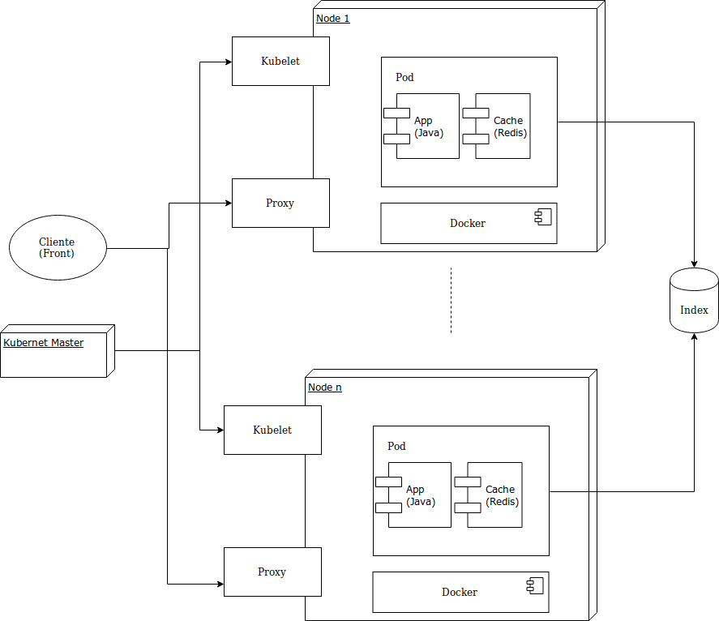

#Introducción

El sistema implementado corresponde a un buscador que permite obtener información básica de títulos pertenecientes a diferentes géneros (Series, Películas, Animes, Videojuegos,etc). Para esto, se hace uso de la base de datos disponible en Imdb (https://www.imdb.com/interfaces/), la cual contiene una gran cantidad de títulos.

Este buscadoe se encuentra desplegado sobre un cluster de Google Cloud, usando kubernetes como herramienta principal para orquestar contenedores (Google Cloud kubernetes Engine).

# Diseño Arquitectural

En el siguiente diagrama se puede apreciar el diseño arquitectural del despliegue de la solución.

Tal como se puede ver, este consiste en un cluster, en el que se puede encontrar un numero definido de PODS. Cada uno de estos encapsula una instancia de la App encargada de procesar las consultas y un Cache (Redis) que permite acelerar el proceso.

Por ultimo, el principal componente usado para soportar las consultas corresponde a un indice invertido, el cual puede ser accedido por cualquiera de las replicas existentes en cada Pod. Para dar persistencia a dicho indice, se hace uso de los volúmenes persistentes de kubernetes.

# Kubernetes

Tal como se menciona anteriormente, el despliegue se hace sobre kubernetes. El uso de esta herramienta representa dos importantes ventajas:

- Control de Trafico: Permite a los desarrolladores abstraerse a la hora de controlar las diferentes peticiones realizadas a la aplicación. Esto a causa de que kubernetes implementa su propio balanceador de carga, para cada servicio, así como también su propio proxy encargado de determinar a que nodo del cluster enviar la consulta.
- Disponibilidad: kubernetes se encarga de la gestión de los contenedores que forman parte del cluster. Específicamente, permite que se mantenga el estado "ideal" o "deseado" definido en la configuración, por lo que si se producen problemas (como puede ser la caída de un nodo), kubernetes se encargara de re ubicarlos en los nodos existentes. De esta forma, se mantiene una mejor disponibilidad.

# Uso del buscador

Para hacer uso del buscador se cuenta con un cliente en la siguiente dirección. https://moviesappsd.herokuapp.com. En este solo se debe ingresar el nombre de algún título junto con el numero máximo de resultados que se desea obtener. Como resultado se obtendrá una lista de títulos de diferentes géneros. El respositorio de dicho cliente se puede encontrar aquí: https://github.com/Felipez-Maturana/MoviesAppSD.

Por otro lado, en caso de que se dese realizar la consulta directamente a la App se debe enviar una petición Post a la siguiente URL: http://35.247.198.0:8082/index/search, donde el json enviado presenta la siguiente estructura:
    - title: Consulta realizada (String)
    - limit: Numero máximo de resultados que se desea obtener (int).

# Despligue de la solución

Para realizar el despliegue de en un cluster sobre kubernetes se deben seguir los siguientes pasos:
    
    
 - Se debe hacer uso del archivo index/Dockerfile-f para crear una imagen docker de la App. Para esto se debe ejecutar el comando docker build -t {Usuario}/{nombre imagen}:{tag} -f Dockerfile-f .

 - Se debe subir la imagen a algun repositorio de contenedores como DockerHub.
 - Posteriormente se debe establecer una conexión con un cluster que tenga instalado Kubernetes. Para este caso se usa GKE.
 - Teniendo la conexión, se deben ejecutar cada uno de los siguientes archivos con .yml para desplegar la solución.:
    - index/index-pvclaim.yml => kubectl apply -f index-pvclaim.yml, para crear un volumen persistente.
    - index/index-deployment.yml => kubectl apply -f index-deployment.yml para desplegar contenedores.
    - index/index-service.yml => kubectl apply -f index-service.yml para exponer el servicio.

